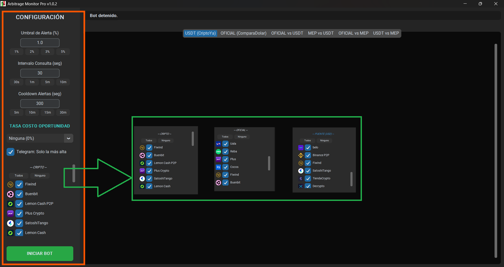
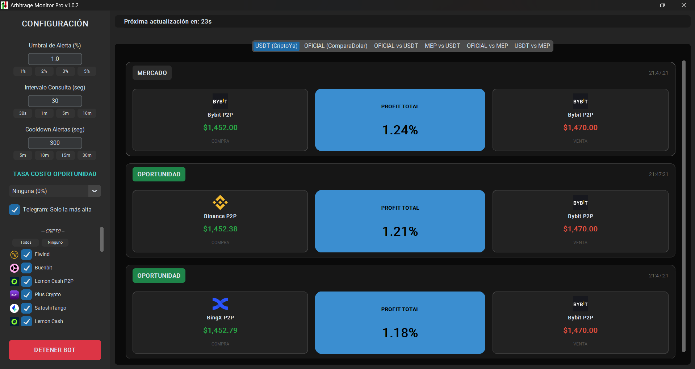

# Arbitrage Monitor Pro 📈

Una herramienta de monitoreo de arbitraje financiero y cripto en tiempo real para el mercado argentino. Compara brechas entre Dólar Oficial, MEP y USDT en múltiples exchanges y entidades bancarias.

## ✨ Características

- **Monitoreo Multimercado:** - **USDT vs USDT:** Arbitraje entre exchanges cripto.
  - **OFICIAL vs OFICIAL:** Comparativa entre entidades bancarias.
  - **OFICIAL vs USDT:** Compra en banco y venta en cripto.
  - **MEP vs USDT:** Arbitraje entre dólar bolsa y cripto.
  - **OFICIAL vs MEP:** El "rulo" clásico (Compra oficial, venta MEP). Actualmente con restricción del BCRA (No es posible operar ambos)
- **Cálculo de Bridge (Puente):** Calcula automáticamente el costo de conversión de USD a USDT usando el mejor exchange disponible.
- **Alertas de Telegram:** Notificaciones automáticas cuando se supera el umbral de ganancia configurado.

## 🚀 Instalación (Para Usuarios)

Si solo quieres usar la aplicación, sigue estos pasos:

1. Ve a la sección de [Releases](https://github.com/raikot365/arbitraje/releases) y descarga el archivo `arbitraje.exe`.
2. Crea una carpeta nueva y coloca el `.exe` dentro.
3. Crea un archivo de texto en esa misma carpeta llamado `.env`.
4. Abre el archivo `.env` con el bloc de notas y pega lo siguiente (completando con tus datos):
   
   ```text
   TELEGRAM_TOKEN=tu_token_de_bot_aqui
   CHAT_ID=tu_chat_id_aqui

## Interfaz
### Configuración

En el costado izquierdo se encuentra la barra de configuraciones, permitiendo seleccionar:
- **Porcentaje**: Para definir el umbral a partir del cual se envía la alerta.
- **Intevalo**: Define cada cuanto se hace la consulta.
- **Cooldown**: Cuanto tiempo pasa antes de enviar una misma alerta entre los mismos exchanges o entidades.
- **Tasa**: Seleccionar la tasa de descuento para liquidaciones del MEP en 24hs. Están disponibles algunas de las más utilizadas.
- **Telegram**: Enviar solo la mejor oferta y no todas la que superan el umbral.
- **Exchanges y Entidades**: Permite seleccionar cuales son los exchanges y entidades para realizar los cálculos del arbitraje. Se encuentran tres opciones:
  - *CRIPTO*: Exchanges USDT.
  - *OFICIAL*: Entidades Dolar Oficial.
  - *PUENTE*: Exchanges paso intermedio.    



### Ventana Principal

Dentro de la venta principal se muestran las oportunidades. Las tarjetas tienen una etiqueta en el borde superior izquierdo que muestra su categoría:
- **MERCADO**: Es la alternativa más rentable para el arbitraje.
- **OPORTUNIDAD**: Es la alternativa que cumple con los requisitos de la configuración (umbral y exchanges/entidades).



```text
* El cálculo realizado no tiene en cuenta las comisiones de los exchanges y/o entidades.